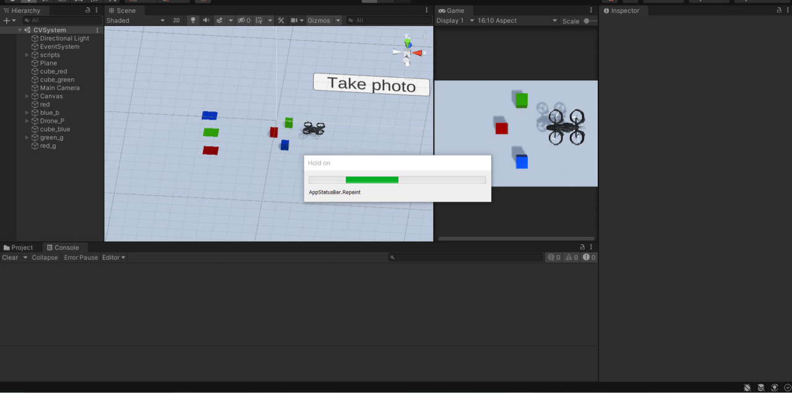
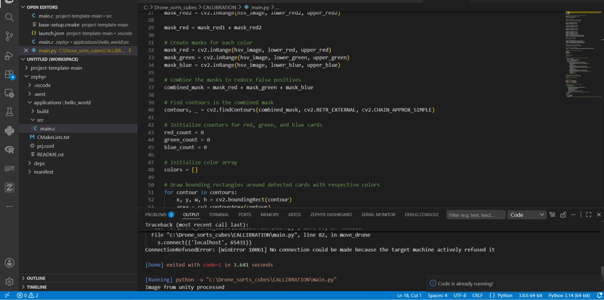
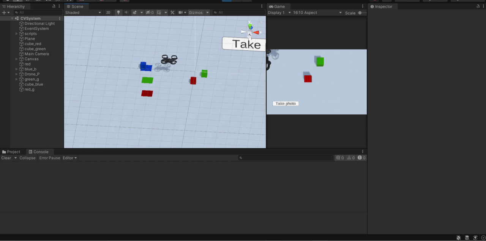
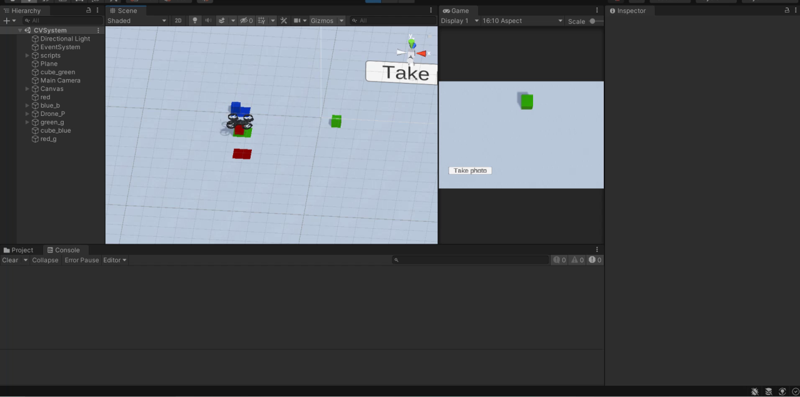

<div align="center">

<br/>

# 🚁 Vision Drone Sorter

### An autonomous drone that *sees* colored cubes and sorts them
#### A Unity simulation driven by a real-time OpenCV computer-vision brain

<br/>

[](https://unity.com/)
[](https://www.python.org/)
[](https://opencv.org/)
[](https://learn.microsoft.com/dotnet/csharp/)
[](LICENSE)

<sub>Perception → Decision → Actuation, all in a single closed loop.</sub>

</div>

<br/>

---

## 🎬 Demo

<div align="center">

<a href="https://github.com/tathagata48/vision-drone-sorter/raw/main/demo.mp4">
  
</a>

<br/>
<br/>

<sub>▶ <b><a href="https://github.com/tathagata48/vision-drone-sorter/raw/main/demo.mp4">Watch the full video with audio</a></b> &nbsp;·&nbsp; <i>preview above is a condensed, silent loop</i></sub>

</div>

---

## 📌 Table of Contents

- [Overview](#-overview)
- [How It Works](#️-how-it-works)
- [Screenshots](#-screenshots)
- [Features](#-features)
- [Architecture](#-architecture)
- [Project Structure](#️-project-structure)
- [Getting Started](#-getting-started)
- [Communication Protocol](#-communication-protocol)
- [Tech Stack](#️-tech-stack)
- [Roadmap](#-roadmap)
- [License](#-license)

---

## 📖 Overview

**Vision Drone Sorter** is a closed-loop robotics simulation that fuses **computer vision** with an **autonomous aerial agent**. A virtual drone in Unity surveys a scene scattered with colored cubes, a Python + OpenCV pipeline identifies each cube by color, and the drone then autonomously picks up every cube and delivers it to its matching drop-off zone — no human in the loop.

It is a compact, end-to-end demonstration of the **sense → perceive → decide → act** cycle that underpins real robotics:

```
 Unity Camera  ──►  Screenshot  ──►  OpenCV Detection  ──►  TCP Command  ──►  Drone Picks & Sorts
    (sense)          (capture)         (perceive)            (decide)              (act)
```

Unity owns the world — physics, the drone, and the environment. Python + OpenCV act as the **brain** that perceives the scene and issues commands across a lightweight TCP socket.

---

## 🖼️ How It Works

| # | Stage | Component | What happens |
|---|-------|-----------|--------------|
| 1 | **Capture** | `Takephoto.cs` | A dedicated Unity camera renders the live scene to a PNG screenshot. |
| 2 | **Perceive** | `main.py` *(OpenCV)* | The image is converted to HSV; red / green / blue masks isolate cubes, contours are extracted, and each cube is counted & classified. |
| 3 | **Decide** | `main.py` *(socket)* | For every detected cube, a color command is streamed to Unity over TCP port `65431`. |
| 4 | **Act** | `DroneMovement.cs` | Unity receives the command and runs a coroutine that flies the drone to the cube, grips it, and drops it in the matching zone. |
| 5 | **Grip** | `pickdrop.cs` | Parents the cube to the drone's gripper on pickup and releases it on drop. |

### 🎯 Detection result

The vision pipeline annotates every detected cube with a color-matched bounding box:

<div align="center">
  
</div>

---

## 📸 Screenshots

<table>
  <tr>
    <td width="50%" align="center">
      
      <br/><sub><b>Scene overview</b> — colored cubes scattered across the field, drone idle, awaiting a capture.</sub>
    </td>
    <td width="50%" align="center">
      
      <br/><sub><b>Vision pipeline</b> — <code>main.py</code> running HSV segmentation and streaming results to Unity.</sub>
    </td>
  </tr>
  <tr>
    <td width="50%" align="center">
      
      <br/><sub><b>Autonomous transport</b> — the drone grips a cube and flies it toward its matching drop-off zone.</sub>
    </td>
    <td width="50%" align="center">
      
      <br/><sub><b>Near completion</b> — most cubes already delivered; the field clears as the sort finishes.</sub>
    </td>
  </tr>
</table>

> The annotated detection output is shown under [How It Works](#-detection-result).

---

## ✨ Features

- 🎥 **Vision-based perception** — captures the live scene and detects red, green & blue cubes via HSV color segmentation.
- 🧠 **Counting & classification** — tallies how many cubes of each color exist and tags every detection.
- 🔌 **Real-time TCP bridge** — Python and Unity stay in sync over a minimal socket protocol on `localhost`.
- 🚁 **Autonomous pick-and-place** — the drone lifts, navigates, grips, transports, and drops each cube at its color-matched zone.
- ♻️ **Sequential task queue** — commands are queued and executed safely on Unity's main thread, one cube at a time.
- 📸 **In-engine screenshot capture** — a purpose-built camera renders the scene straight into the vision pipeline.

---

## 🏗 Architecture

```
        ┌─────────────────────────────┐                ┌──────────────────────────────┐
        │           UNITY              │                │        PYTHON  +  OpenCV      │
        │                              │                │                              │
        │  ┌────────────────────────┐  │   screenshot   │  ┌────────────────────────┐  │
        │  │   Takephoto.cs (cam)   │──┼───────────────►│  │  HSV mask + contours   │  │
        │  └────────────────────────┘  │     (.png)     │  └───────────┬────────────┘  │
        │                              │                │              │ colors[]      │
        │  ┌────────────────────────┐  │  TCP :65431    │  ┌───────────▼────────────┐  │
        │  │  DroneMovement.cs      │◄─┼────────────────┼──│   socket client        │  │
        │  │  (flight + queue)      │  │  "red/green/   │  │   move_drone(color)    │  │
        │  └───────────┬────────────┘  │    blue"       │  └────────────────────────┘  │
        │              │               │                │                              │
        │  ┌───────────▼────────────┐  │                └──────────────────────────────┘
        │  │   pickdrop.cs (grip)   │  │
        │  └────────────────────────┘  │
        └─────────────────────────────┘
```

---

## 🗂️ Project Structure

```
vision-drone-sorter/
├── Assets/
│   ├── Scenes/
│   │   └── CVSystem.unity           # Main simulation scene
│   ├── Scripts/
│   │   ├── DroneMovement.cs         # TCP listener + autonomous flight & pick-and-place
│   │   ├── Takephoto.cs             # In-engine camera screenshot capture
│   │   └── pickdrop.cs              # Gripper attach / release logic
│   ├── Materials/ · Textures/       # Scene look & feel
│   └── ...                          # Models & supporting assets
├── ProjectSettings/                 # Unity project configuration
├── Packages/                        # Unity package manifest
├── main.py                          # Python OpenCV detection + drone controller
├── requirements.txt                 # Python dependencies
├── detected_cards_colored.png       # Sample detection output
├── demo.mp4                         # Demo recording
└── README.md
```

---

## 🚀 Getting Started

### Prerequisites

- **Unity 2020.3 LTS** (e.g. `2020.3.17f1`) — install via [Unity Hub](https://unity.com/download)
- **Python 3.8+**

### 1 · Clone the repository

```bash
git clone https://github.com/tathagata48/vision-drone-sorter.git
cd vision-drone-sorter
```

### 2 · Set up the Python environment

```bash
python -m venv venv

# Windows
venv\Scripts\activate
# macOS / Linux
source venv/bin/activate

pip install -r requirements.txt
```

### 3 · Open the Unity project

1. Open **Unity Hub → Add → select this project folder**.
2. Open the scene `Assets/Scenes/CVSystem.unity`.
3. Press **▶ Play**. The drone spins up a TCP server on port `65431` and waits for commands.

### 4 · Run the vision pipeline

With Unity in Play mode, capture a screenshot of the scene, then run:

```bash
python main.py
```

> **Note** — update `image_path` in `main.py` to point at your captured screenshot. The script detects each cube, prints per-color counts, and streams sorting commands to the running Unity simulation.

---

## 🧩 Communication Protocol

A minimal text protocol over TCP keeps the two worlds in lockstep:

| Field | Value |
|-------|-------|
| **Host** | `localhost` |
| **Port** | `65431` |
| **Payload** | One of `red`, `green`, `blue` (ASCII) |
| **Flow control** | Unity ignores new commands while the drone is `isBusy`, guaranteeing one clean pick-and-place at a time |

---

## 🛠️ Tech Stack

| Layer | Technology |
|-------|------------|
| **Simulation** | Unity 2020.3 LTS — 3D world, physics, coroutine-based motion |
| **Scripting** | C# — networking, flight control, gripper logic |
| **Orchestration** | Python 3 |
| **Vision** | OpenCV — HSV color segmentation & contour detection |
| **Math** | NumPy — array / mask operations |
| **Transport** | TCP sockets — inter-process bridge between Python and Unity |

---

## 🗺️ Roadmap

- [ ] Replace fixed delays with an ACK-based handshake for faster, deterministic sorting
- [ ] Live camera feed instead of a single screenshot per run
- [ ] Support for additional colors and arbitrary drop-zone mapping
- [ ] Swap HSV thresholding for a lightweight ML detector
- [ ] On-screen HUD showing detection counts and drone state

---

## 📜 License

Distributed under the **MIT License**. See [`LICENSE`](LICENSE) for full details.

---

<div align="center">
<sub>Built with Unity, OpenCV, and a lot of hovering. ⚙️🚁</sub>
</div>
